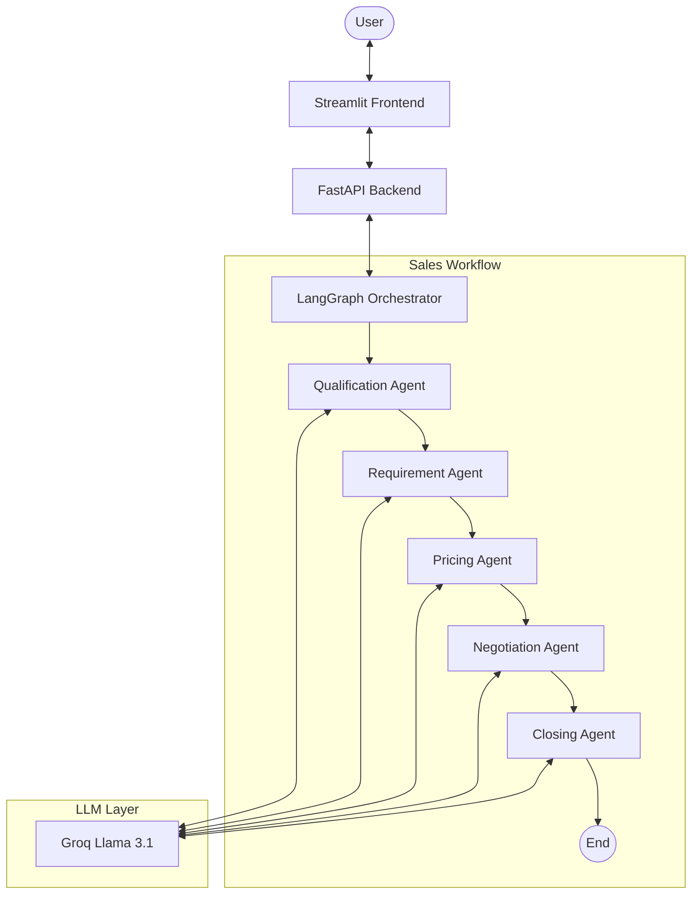

# AI Agentic Sales Assistant 🤖

A sophisticated multi-agent sales system built with **LangGraph**, **FastAPI**, and **Streamlit**. This assistant automates the sales lifecycle—from initial lead qualification to final closing—using specialized AI agents powered by **Groq (Llama 3.1)**.

## 🌟 Features

The system employs a sequential multi-agent workflow where each stage of the sales process is handled by a dedicated expert agent:

1.  **Qualification Agent**: Screens leads by asking about company type, use case, budget, and timeline.
2.  **Requirement Agent**: Performs deep analysis to extract specific project types and feature requirements.
3.  **Pricing Agent**: Calculates value-based pricing (ranging from ₹40,000 to ₹1,20,000) based on complexity.
4.  **Negotiation Agent**: Handles objections with strict rules (max 15% discount, never below floor price) and justifies value.
5.  **Closing Agent**: Finalizes the deal and collects essential contact information (name, email, phone).

## 🏗️ Architecture



## 🛠️ Tech Stack

- **Framework**: [LangGraph](https://github.com/langchain-ai/langgraph) (Custom State Management)
- **LLM Provider**: [Groq](https://groq.com/) (Model: `llama-3.1-8b-instant`)
- **API Foundation**: [FastAPI](https://fastapi.tiangolo.com/)
- **Frontend**: [Streamlit](https://streamlit.io/)
- **Environment Management**: `.env` with `python-dotenv`

## 🚀 Getting Started

### Prerequisites

- Python 3.10+
- A Groq API Key (Get it at [Groq Cloud](https://console.groq.com/))

### Installation

1. **Clone the repository:**
   ```bash
   git clone <repository-url>
   cd AgenticSalesAssistant
   ```

2. **Create and activate a virtual environment:**
   ```bash
   python -m venv .venv
   # Windows:
   .venv\Scripts\activate
   # Mac/Linux:
   source .venv/bin/activate
   ```

3. **Install dependencies:**
   ```bash
   pip install -r requirements.txt
   ```

4. **Configure environment variables:**
   Create a `.env` file in the root directory:
   ```env
   GROQ_API_KEY=your_groq_api_key_here
   ```

### Running the Application

This project requires both the backend and frontend to be running simultaneously.

1. **Start the FastAPI Backend:**
   ```bash
   python api.py
   ```
   The backend will run at `http://127.0.0.1:8000`.

2. **Start the Streamlit Frontend:**
   Open a new terminal and run:
   ```bash
   streamlit run main.py
   ```
   The interactive UI will open in your browser (usually at `http://localhost:8501`).

## 📂 Project Structure

- `agent.py`: Logic for specialized sales agents.
- `graph.py`: LangGraph workflow definition and state management.
- `api.py`: FastAPI server exposing the agent as a REST endpoint.
- `main.py`: Streamlit chat interface.
- `config.py`: Centralized LLM and environment configuration.
- `requirements.txt`: List of Python dependencies.

---
*Built with ❤️ using LangChain & LangGraph.*
